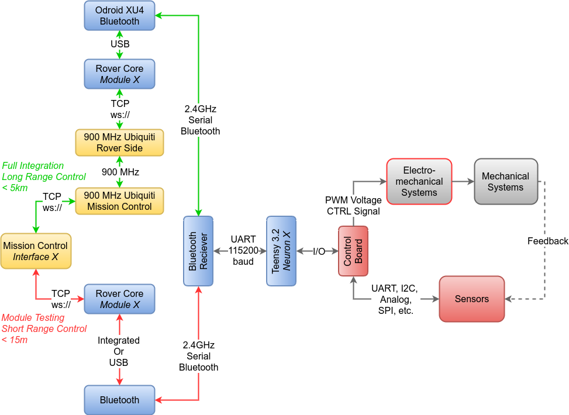

About
======

Project Goals and Objectives
-----------------------------

The purpose of RoverCore is to be an alternative to existing robotic frameworks such ROS (Robotic Operating System). The RoverCore (MC/S/F) software stack was modeled after MVC, where RoverCore-S acts model, RoverCore-MC acts as the view and RoverCore-F is the controller.

The following image shows the communication between MC->S->F.

    Rover Core  MC->S->F Data Path [Yellow is MC, Blue is S and Red is F]

The RoverCore project was designed for the Robotics Team at San Jose State University.